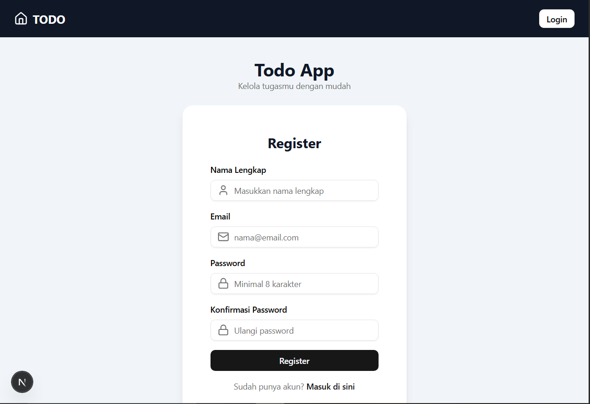
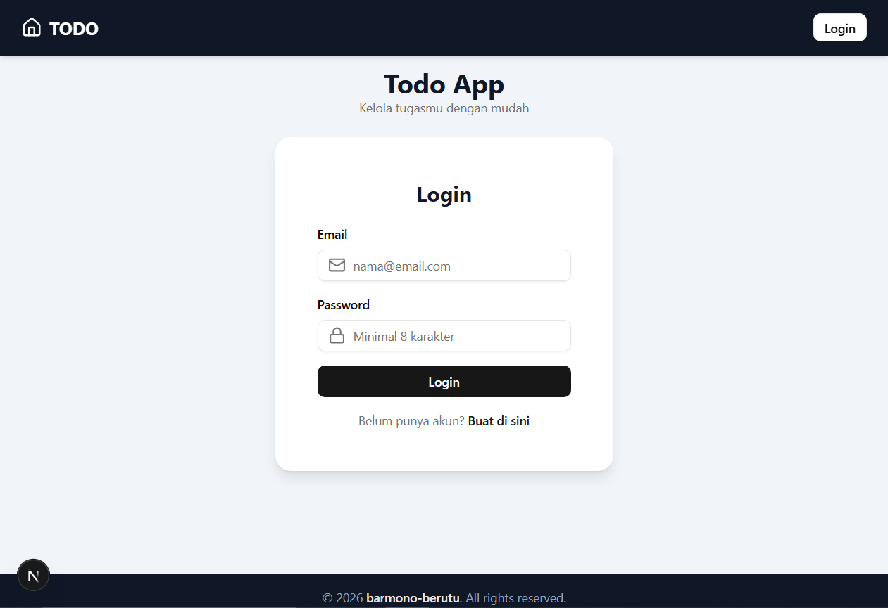
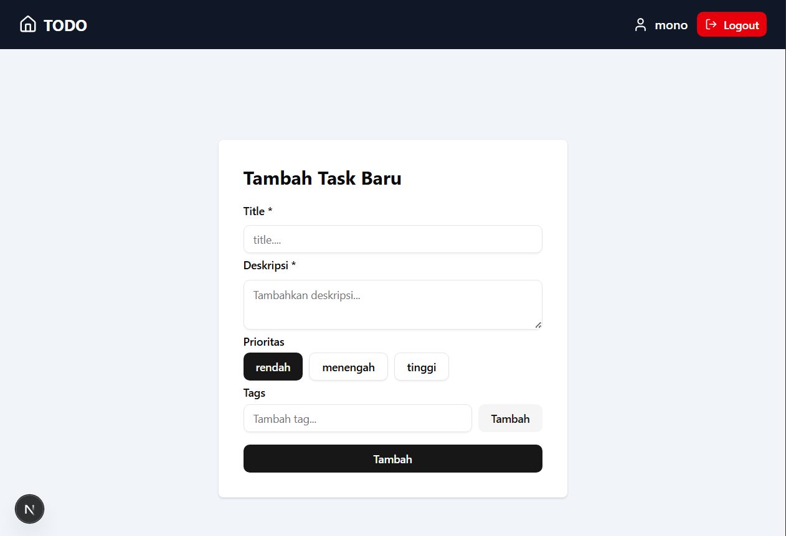
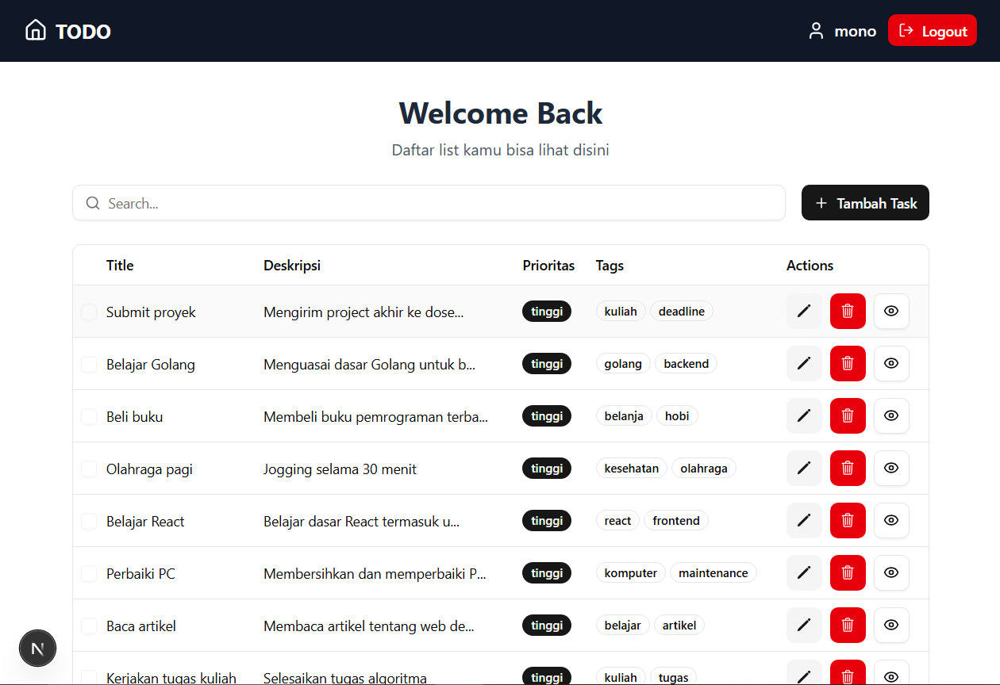
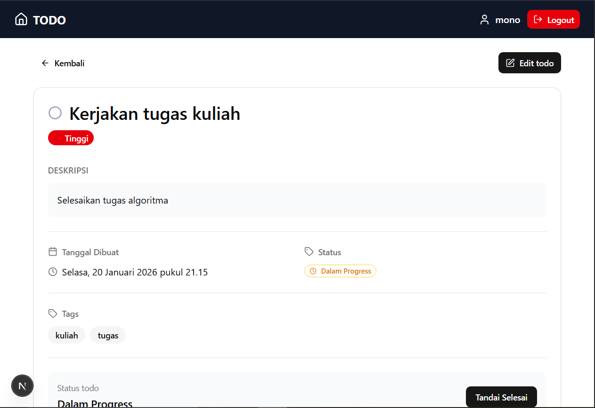
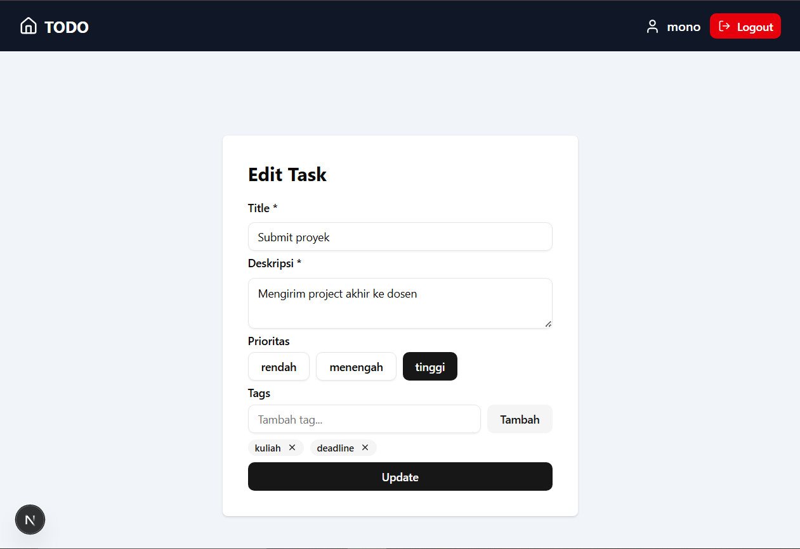
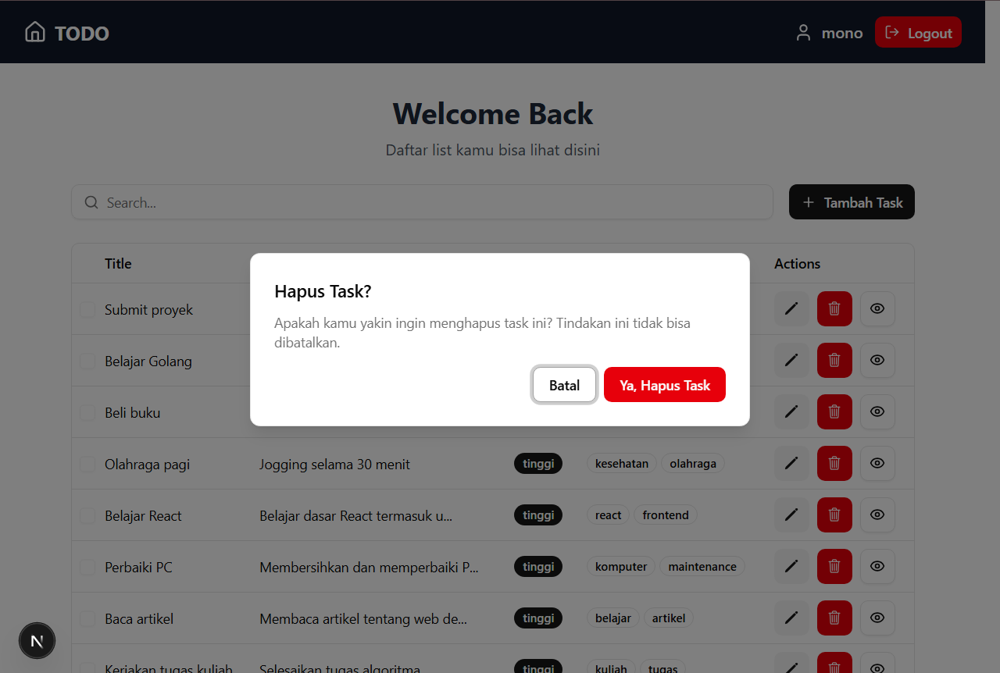

# Todo - Manajer Tugas Pribadi Anda

## 📖 Latar Belakang

Mengatur tugas sehari-hari sering kali membingungkan jika tidak tercatat dengan baik. **Todo** dibuat untuk membantu pengguna mencatat, mengelola, dan menyelesaikan tugas secara efisien. Dengan aplikasi ini, pengguna dapat fokus pada pekerjaan penting tanpa kehilangan jejak tugas yang harus dilakukan.

---

## ✨ Fitur Utama

- **Autentikasi Aman**: Pengguna harus login untuk mengakses data mereka, menjaga privasi dan keamanan tugas.
- **Buat Tugas**: Menambahkan tugas baru dengan judul, deskripsi, prioritas, dan tag.
- **Edit Tugas**: Memperbarui detail tugas yang sudah ada.
- **Hapus Tugas**: Menghapus tugas yang selesai atau tidak diperlukan.
- **Filter & Sorting**: Menyaring tugas berdasarkan prioritas atau kategori tertentu.
- **Tampilan Tabel Interaktif**: Menampilkan daftar tugas dalam tabel yang dapat diurutkan dan difilter.

---

## 🛠 Teknologi yang Digunakan

| Teknologi              | Alasan Penggunaan                                                                                                                |
| ---------------------- | -------------------------------------------------------------------------------------------------------------------------------- |
| **Next.js**            | Memudahkan pengembangan fullstack karena frontend dan backend berada di satu proyek, mempercepat development dan manajemen kode. |
| **Prisma (ORM)**       | Mempermudah interaksi dengan database menggunakan TypeScript, query lebih aman dan cepat.                                        |
| **PostgreSQL**         | Database relasional yang stabil, cocok untuk menyimpan data tugas skala kecil hingga menengah.                                   |
| **NextAuth**           | Sistem autentikasi aman dan mudah diimplementasikan, mendukung session JWT.                                                      |
| **TanStack Query**     | Mempermudah pengambilan dan caching data dari API, mendukung update data real-time.                                              |
| **TanStack Table**     | Menampilkan data dalam tabel interaktif dengan sorting, filtering, dan pagination.                                               |
| **Zustand**            | Manajemen state global ringan untuk menyimpan data tugas, filter, dan status login.                                              |
| **Postman**            | Untuk menguji API dan memastikan endpoint backend berfungsi dengan benar.                                                        |
| **Visual Studio Code** | IDE populer dengan banyak ekstensi yang mendukung produktivitas.                                                                 |

---

## 4.6 State Management (Detail Todo)

Untuk mengelola state aplikasi, terutama data **tugas**, filter, dan status login pengguna, digunakan **Zustand**.

**Alasan memilih Zustand:**

- Ringan dan mudah dipelajari, tidak seperti Redux yang butuh banyak boilerplate.
- Performa bagus: hanya komponen yang membutuhkan state tertentu yang di-render ulang.
- Struktur store sederhana, mudah di-maintain untuk proyek skala kecil hingga menengah.
- Reactive: update state langsung terlihat di UI tanpa konfigurasi tambahan.

**Kenapa tidak menggunakan Redux atau Context API:**

- **Redux** terlalu berat untuk proyek kecil dan verbose, lebih cocok untuk aplikasi besar dengan banyak state global kompleks.
- **Context API** bagus untuk state yang jarang berubah, tapi jika state sering diupdate (misal daftar tugas), bisa menyebabkan banyak re-render yang tidak perlu.

---

## ⚙️ Cara Instalasi

1. **Clone Repository**

   ```bash
   git clone https://github.com/Barmono-Berutu/Todo-Web-Project.git
   cd Todo-Web-Project
   ```

2. **Setup File Konfigurasi**

   ```bash
   cp .env.example .env
   ```

   Sesuaikan parameter di `.env` seperti `DB_HOST`, `DB_USER`, `DB_PASSWORD`, dan `AUTH_SECRET`.

3. **Install Dependencies**

   ```bash
   npm i
   ```

4. **Run Server**
   ```bash
   npm run dev
   ```
5. **Server Akan Berjalan di**
   ```bash
   http://localhost:3000/
   ```

---

## **Contoh Tampilan Website**

### **1. User Autentikasi**

- **Registrasi**  
  
- **Login**  
  

### **2. CRUD Todo**

- **Menambahkan Data**  
  

- **Melihat Semua Data**  
  

- **Melihat Data Berdasarkan ID**  
  

- **Mengedit Data**  
  

- **Menghapus Data**  
  

---

## 📝 Catatan

Aplikasi Todo ini masih dalam tahap awal pengembangan. Beberapa fitur masih sederhana, belum sepenuhnya optimal, dan kemungkinan masih terdapat bug.

Tampilan aplikasi juga belum responsif sepenuhnya, sehingga masih bisa dikembangkan lagi ke depannya.

Ke depannya, aplikasi ini masih terbuka untuk penambahan fitur, perbaikan UI/UX, dan peningkatan pengalaman pengguna.

Silakan beri saran atau masukan. Setiap feedback sangat berarti. 🚀
